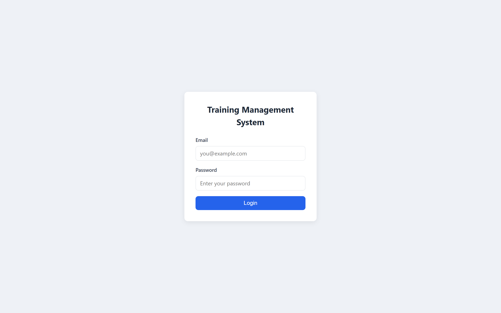
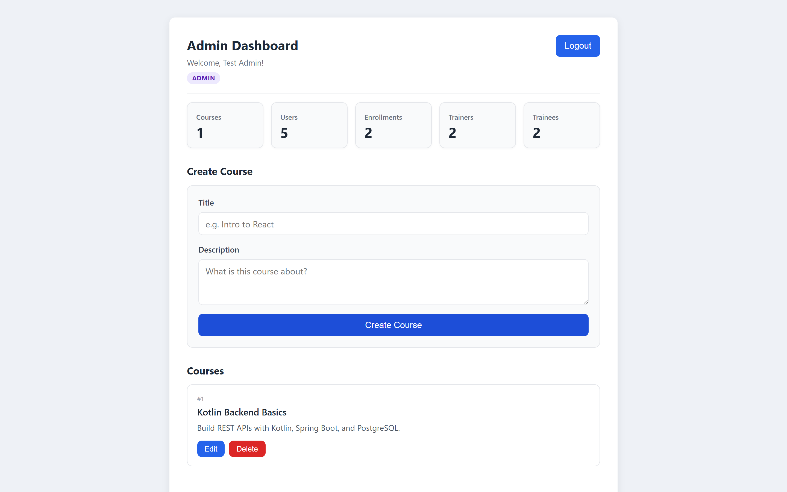
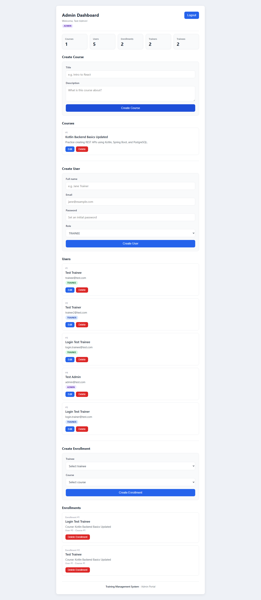
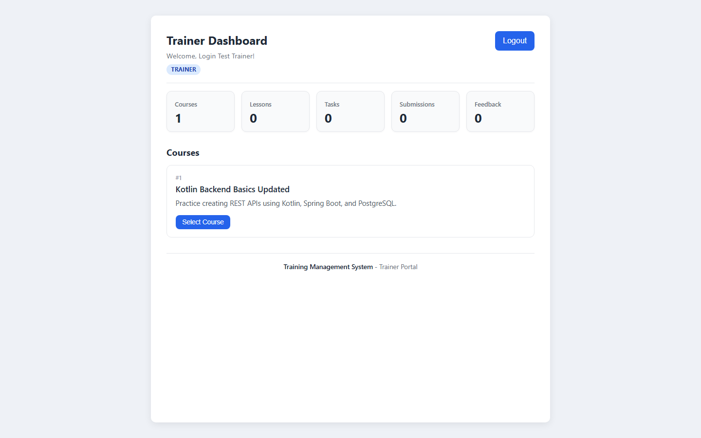
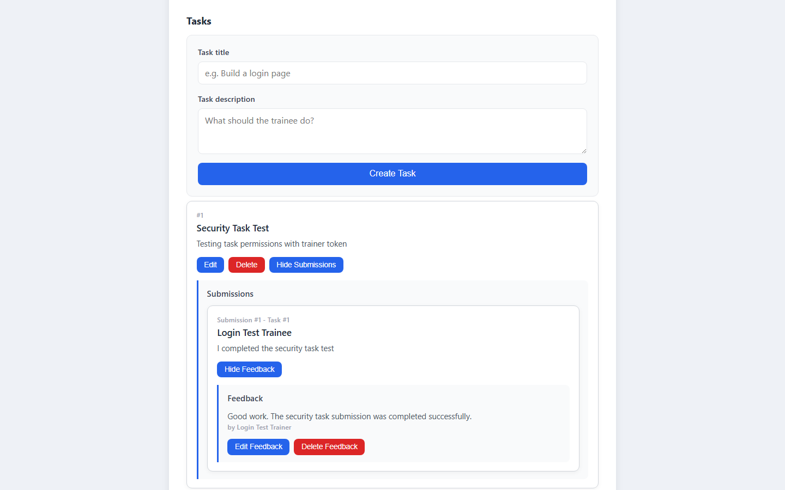
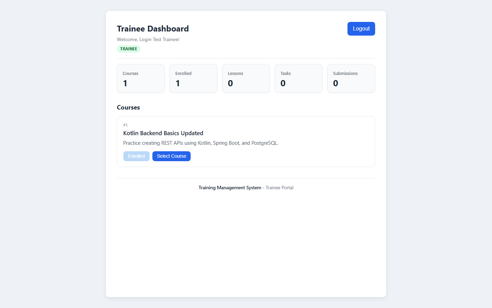
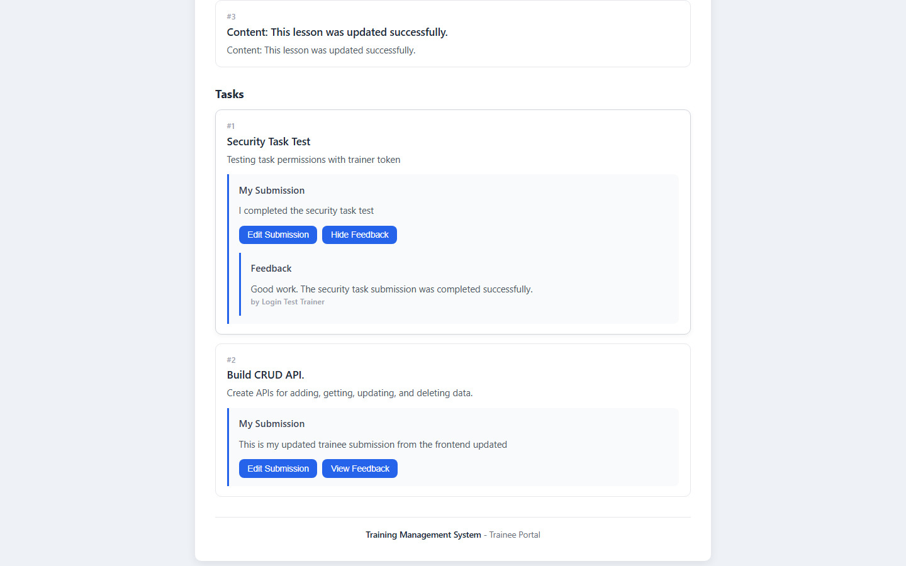

# Training Management System

A full-stack web application for managing training programs. Admins manage
courses, users, and enrollments; trainers add lessons, tasks, and feedback;
and trainees enroll in courses, submit work, and read their feedback. Access
is protected with JWT authentication and role-based permissions.

**Repository:** https://github.com/amrooo-debug/Full_Stack_Project_Training_Management_System

---

## Table of Contents

- [Main Features](#main-features)
- [User Roles](#user-roles)
  - [Admin](#admin)
  - [Trainer](#trainer)
  - [Trainee](#trainee)
- [Tech Stack](#tech-stack)
- [Project Structure](#project-structure)
- [Local Setup](#local-setup)
  - [1. Prerequisites](#1-prerequisites)
  - [2. PostgreSQL Database](#2-postgresql-database)
  - [3. Environment Variables](#3-environment-variables)
  - [4. Backend Setup and Run](#4-backend-setup-and-run)
  - [5. Frontend Setup and Run](#5-frontend-setup-and-run)
- [Application URLs](#application-urls)
- [Seeding Demo Data / First Login](#seeding-demo-data--first-login)
- [Test Login Accounts](#test-login-accounts)
- [Running Tests](#running-tests)
- [Frontend Environment Variable](#frontend-environment-variable)
- [Screenshots](#screenshots)
- [Recently Improved](#recently-improved)
- [Future Improvements](#future-improvements)

---

## Main Features

- Role-based login with JWT authentication (Admin, Trainer, Trainee).
- Course, lesson, and task management.
- Trainee enrollment and self-enrollment.
- Work submission and editing by trainees.
- Feedback creation, editing, and deletion by trainers.
- Dashboard summary cards showing live counts for each role.
- Clear, consistent backend error messages and HTTP status codes.

---

## User Roles

The system supports three roles. Each user can only reach the dashboard and
actions allowed for their role.

### Admin

The admin manages the core system data.

- **Manage courses** – create, view, edit, and delete courses.
- **Manage users** – create, view, edit, and delete users, and set their role
  (Admin, Trainer, or Trainee).
- **Manage enrollments** – enroll a trainee into a course, view all
  enrollments, and delete enrollments. Duplicate enrollments are prevented.
- **View dashboard summary cards** – live totals for Courses, Users,
  Enrollments, Trainers, and Trainees.

### Trainer

The trainer manages course content and reviews trainee work.

- **View courses** – browse the available courses and select one to manage.
- **Manage lessons** – create, edit, and delete lessons for a course.
- **Manage tasks** – create, edit, and delete tasks for a course.
- **View submissions** – see the work trainees submitted for each task.
- **Create, edit, and delete feedback** – leave feedback on a submission,
  update it, or remove it. Only one feedback per submission is allowed.

### Trainee

The trainee learns from courses and submits work.

- **View courses** – browse all courses.
- **Enroll in courses** – self-enroll and see the "Enrolled" status.
- **View lessons** – read the lessons for a selected course.
- **View tasks** – see the tasks for a selected course.
- **Submit work** – submit an answer for a task.
- **Edit submissions** – update a previously submitted answer.
- **View feedback** – read the trainer's feedback on a submission.

---

## Tech Stack

| Layer            | Technologies                                              |
| ---------------- | --------------------------------------------------------- |
| Backend          | Kotlin, Spring Boot, Spring Security, Spring Data JPA      |
| Database         | PostgreSQL                                                 |
| Authentication   | JWT (JSON Web Tokens)                                      |
| Frontend         | React, TypeScript, Vite, React Router                     |
| Styling          | CSS                                                       |
| Build tools      | Gradle (Kotlin DSL), npm                                   |
| Language runtime | Java 21, Kotlin 2.3.x                                      |

---

## Project Structure

```text
training-management-system
│
├── src
│   ├── main/kotlin/com/example/trainingmanagementsystem
│   │   ├── config          # Security config and JWT filter
│   │   ├── controller      # REST controllers (API endpoints)
│   │   ├── dto             # Request/response data classes
│   │   ├── entity          # JPA entities (database tables)
│   │   ├── enums           # UserRole enum
│   │   ├── exception       # Global exception handler
│   │   ├── repository      # Spring Data JPA repositories
│   │   └── service         # Business logic
│   ├── main/resources/application.properties
│   └── test/kotlin/...     # Backend service unit tests + contextLoads
│
├── frontend
│   ├── src
│   │   ├── components/DashboardHeader.tsx
│   │   ├── AdminDashboard.tsx
│   │   ├── TrainerDashboard.tsx
│   │   ├── TraineeDashboard.tsx
│   │   ├── LoginPage.tsx
│   │   ├── api.ts             # Shared fetch helper + base URL
│   │   ├── errors.ts          # Shared getErrorMessage helper
│   │   ├── dashboardPaths.ts  # Role -> dashboard path helper
│   │   ├── types.ts           # Shared TypeScript types
│   │   ├── api.test.ts        # Vitest unit test
│   │   ├── App.tsx
│   │   ├── App.css
│   │   └── index.css
│   ├── e2e                    # Playwright end-to-end specs
│   ├── .env.example
│   └── package.json
│
├── docs/screenshots           # Screenshots used in this README
│
├── build.gradle.kts
├── settings.gradle.kts
└── README.md
```

---

## Local Setup

> **Presenting or demoing locally?** For a step-by-step local demo startup guide,
> see [docs/LOCAL_DEMO_RUNBOOK.md](docs/LOCAL_DEMO_RUNBOOK.md).

### 1. Prerequisites

Make sure the following are installed:

- **Java 21** (JDK 21)
- **Node.js 20.19+ or 22.12+** and **npm** (required by the current Vite version)
- **PostgreSQL**
- **Git**

### 2. PostgreSQL Database

The backend expects a PostgreSQL database with these settings (from
`src/main/resources/application.properties`):

```text
Host:     localhost
Port:     5000
Database: training_db
Username: postgres
Password: (provided via the DB_PASSWORD environment variable)
```

Create the database once before running the backend, for example:

```sql
CREATE DATABASE training_db;
```

> Note: PostgreSQL uses port **5000** in this project (not the default 5432).
> If your PostgreSQL runs on a different port, update the `spring.datasource.url`
> in `application.properties`.

The tables are created automatically on first run
(`spring.jpa.hibernate.ddl-auto=update`).

### 3. Environment Variables

The backend reads two required values from environment variables so secrets are
never committed to source control:

```text
DB_PASSWORD   # your PostgreSQL password
JWT_SECRET    # a long, random secret used to sign JWT tokens
```

These map to placeholders in `application.properties`:

```properties
spring.datasource.password=${DB_PASSWORD}
app.jwt.secret=${JWT_SECRET}
```

> Do not commit real passwords or JWT secrets to GitHub.

### 4. Backend Setup and Run

From the project root, set the environment variables and start the backend
(PowerShell on Windows):

```powershell
cd "C:\Users\Amro Folowise\IdeaProjects\training-management-system"
$env:JWT_SECRET="a-long-random-local-development-secret-change-me"
$env:DB_PASSWORD="your_local_db_password"
.\gradlew bootRun --no-daemon
```

Replace the values above with your own local PostgreSQL password and a long,
random JWT secret. These are local development values only — never reuse them
in production.

The backend starts on **http://localhost:8080**.

> You can also run `TrainingManagementSystemApplication.kt` from IntelliJ IDEA
> after adding `DB_PASSWORD` and `JWT_SECRET` to the Run Configuration.

### 5. Frontend Setup and Run

In a separate terminal, install dependencies (first time only) and start the
dev server:

```bash
cd "C:\Users\Amro Folowise\IdeaProjects\training-management-system\frontend"
npm install
npm run dev
```

The frontend starts on **http://localhost:5173**.

To create a production build instead:

```bash
npm run build
```

---

## Application URLs

| What              | URL                              |
| ----------------- | -------------------------------- |
| Frontend          | http://localhost:5173            |
| Login page        | http://localhost:5173/login      |
| Admin dashboard   | http://localhost:5173/admin      |
| Trainer dashboard | http://localhost:5173/trainer    |
| Trainee dashboard | http://localhost:5173/trainee    |
| Backend API       | http://localhost:8080            |

---

## Seeding Demo Data / First Login

Before starting the backend, make sure **PostgreSQL is running** and the
`training_db` database exists (see [PostgreSQL Database](#2-postgresql-database)).

On the first run, Hibernate creates the tables automatically because
`spring.jpa.hibernate.ddl-auto=update` is set — but it only creates **empty
tables**. It does not insert any users. The application also has no public
self-registration endpoint; the only public endpoint is `POST /auth/login`, and
user creation (`POST /users`) requires an existing Admin.

This means the demo accounts below are expected to **already exist in your local
`training_db`** — they were created during development and live only in the local
database (which is not committed to source control). There is currently no
automated seed script.

If you are starting from a completely empty database, create the first **Admin**
user directly in PostgreSQL (passwords are stored bcrypt-hashed, so insert a
bcrypt hash rather than plain text), then sign in as that Admin and use the Admin
Dashboard to create the Trainer and Trainee users. Automating this with a seed
script is listed under [Future Improvements](#future-improvements).

---

## Test Login Accounts

The accounts below are **local demo credentials only** — they exist purely to
explore each role on a local machine and must **never** be used in production.

| Role    | Email                     | Password |
| ------- | ------------------------- | -------- |
| Admin   | admin@test.com            | 123456   |
| Trainer | login.trainer@test.com    | 123456   |
| Trainee | login.trainee@test.com    | 123456   |

---

## Running Tests

The project includes backend unit tests, frontend unit tests, and end-to-end
tests. Run them from the locations shown below.

**Backend — Kotlin service/unit tests** (from the project root):

```powershell
.\gradlew test
```

Runs the Kotlin service unit tests (`CourseServiceTest`, `FeedbackServiceTest`,
`SubmissionServiceTest`) together with the Spring `contextLoads` application test.
Because the context test boots the full application, it needs PostgreSQL running
and the `DB_PASSWORD` and `JWT_SECRET` environment variables set, just like a
normal backend run.

**Frontend — unit tests** (from the `frontend` folder):

```bash
npm test
```

Runs the Vitest unit tests only (`src/**/*.test.ts`). These do not require the
backend or the dev server to be running. Playwright end-to-end specs are
excluded from this command.

**Frontend — end-to-end tests** (from the `frontend` folder):

```bash
npm run test:e2e
```

Runs the Playwright end-to-end tests. The Playwright config does **not** start
any servers itself, so before running this you must already have the **backend
running on http://localhost:8080** and the **frontend dev server running on
http://localhost:5173**, with the demo accounts available in the database.

**Frontend — production build** (from the `frontend` folder):

```bash
npm run build
```

Runs the TypeScript project build (`tsc -b`) followed by the Vite production
build, producing the optimized static output in `frontend/dist`.

---

## Frontend Environment Variable

The frontend base API URL is configurable through a Vite environment variable.
If it is not set, it falls back to `http://localhost:8080`, so local development
works with no extra setup.

```text
VITE_API_BASE_URL=http://localhost:8080
```

To customize it, copy `frontend/.env.example` to `frontend/.env` and change the
value. A real `.env` file is git-ignored and should not be committed.

---

## Screenshots

**Login Page**



**Admin Dashboard**



**Admin — Users and Enrollments**



**Trainer Dashboard**



**Trainer — Submissions and Feedback**



**Trainee Dashboard**



**Trainee — Submission and Feedback**



---

## Recently Improved

- **Better backend error messages** – consistent, readable messages with
  correct HTTP status codes (404 not found, 409 conflict, 400 invalid).
- **Clean dashboard numbering** – stable, readable item numbering on the
  dashboards.
- **Shared frontend error helper** – a single `getErrorMessage` helper
  (`frontend/src/errors.ts`) reused across dashboards instead of duplicated code.
- **Frontend warning cleanup** – resolved React/TypeScript and ESLint warnings
  (event typing, ignored promises, effect/state rules) without changing behavior.
- **Environment-configurable API base URL** – `VITE_API_BASE_URL` with a
  localhost fallback.

---

## Future Improvements

Backend service unit tests, frontend unit tests, and Playwright end-to-end tests
already exist (see [Running Tests](#running-tests)). Planned next steps build on
top of that foundation:

- **Testing** – expand overall test coverage, add controller/integration tests
  for the REST endpoints, and add a CI pipeline to run the test suites
  automatically.
- **Demo data** – add an automated seed script so a fresh database has the demo
  Admin/Trainer/Trainee accounts without manual setup.
- **Frontend** – extract more reusable components to simplify the dashboards.
- **Deployment (future phase)** – the project currently runs locally only;
  cloud deployment for the backend, frontend, and database is planned as a later
  phase, with hosting and environment instructions to follow.
